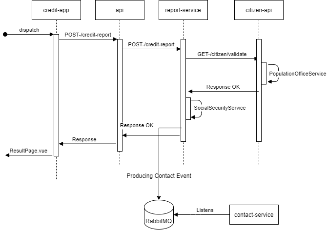

# ing-bootcamp-project
## ING Agile Developer Bootcamp 2021 için geliştirdiğim projedir.
Bir banka müşterisinin ne kadar kredi alabileceğini sorguladığı mikroservis uygulaması.

[Demo linki](http://129.159.207.148:5000/)

## Sequence Diagram 

### Kurulum
- `git clone git@github.com:cflv5/ing-bootcamp-project.git`
- `cd ing-bootcamp-project/credit-app`
- `npm install`
- `npm run build`
- `cd ..`
- `docker-compose up --build`
